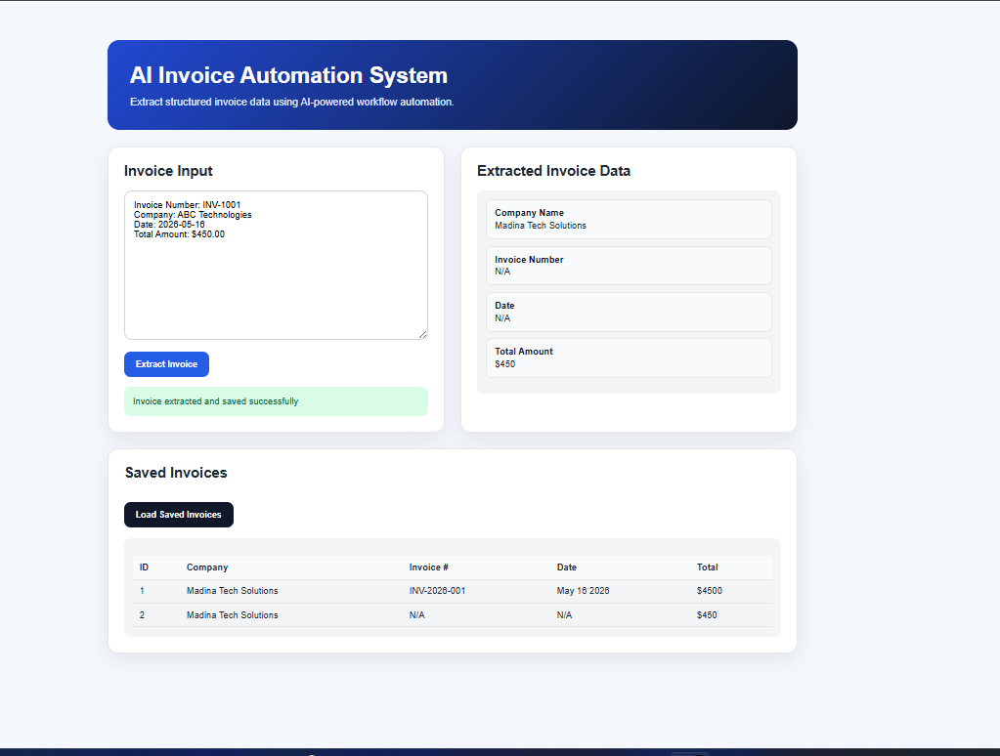

# AI Invoice Automation System

A full-stack AI-powered invoice automation platform built using FastAPI, JavaScript, SQLite, and intelligent invoice extraction workflows.

The system allows users to:
- submit invoice text
- extract structured invoice data
- store invoices in a database
- view saved invoices through a frontend dashboard

---

# Screenshots

## Dashboard



## API Documentation


---

# Features

## AI Invoice Extraction
Extracts:
- Company Name
- Invoice Number
- Invoice Date
- Total Amount

## Backend API
Built using FastAPI with REST endpoints.

## Database Storage
Stores invoice records using SQLite and SQLAlchemy.

## Frontend Dashboard
Simple web dashboard for:
- invoice submission
- extraction results
- viewing saved invoices

## Automation Workflow
Demonstrates AI automation pipelines and structured data processing.

---

# Tech Stack

- Python
- FastAPI
- SQLite
- SQLAlchemy
- JavaScript
- HTML/CSS
- REST APIs

---

# Project Structure

```bash
ai-invoice-automation-system/
│
├── app/
│   ├── main.py
│   ├── ai_extractor.py
│   └── database.py
│
├── frontend/
│   ├── index.html
│   ├── style.css
│   └── script.js
│
├── screenshots/
│   ├── dashboard.png
│   └── swagger-api.png
│
├── requirements.txt
└── README.md
```

---

# API Endpoints

## Extract Invoice

```http
POST /extract-invoice
```

Extracts structured invoice data.

### Example Request

```json
{
  "invoice_text": "Invoice #INV-2026-001 from Madina Tech Solutions dated May 16 2026. Total amount due is $4500."
}
```

---

## Get Saved Invoices

```http
GET /invoices
```

Returns all stored invoices.

---

# Setup Instructions

## Clone Repository

```bash
git clone https://github.com/NASRATULLAH786/ai-invoice-automation-system.git
```

## Create Virtual Environment

```bash
python -m venv venv
```

## Activate Virtual Environment

### Windows

```bash
venv\Scripts\activate
```

### Linux / Mac

```bash
source venv/bin/activate
```

## Install Dependencies

```bash
pip install -r requirements.txt
```

## Run Backend

```bash
uvicorn app.main:app --reload --port 8080
```

## Open Frontend

Open:

```text
frontend/index.html
```

in your browser.

---

# Future Improvements

- PDF upload support
- OCR extraction
- Docker deployment
- Authentication system
- Cloud deployment
- AI model integrations
- Email automation workflows
- n8n workflow orchestration

---

# Author

Nasratullah Mirzai