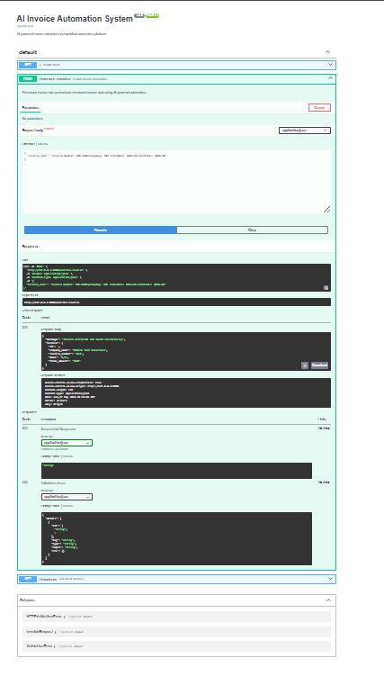

# AI Invoice Automation System


## Overview

AI Invoice Automation System is a practical AI-powered workflow automation project that extracts structured invoice information from raw invoice text and stores the result in a database.

The system includes:
- FastAPI backend
- Modern frontend dashboard
- Invoice extraction workflow
- Database integration
- API documentation
- Invoice history tracking

## Problem Statement

Manual invoice processing is time-consuming, repetitive, and error-prone. Businesses often manually extract invoice numbers, company names, dates, and total amounts from invoices.

This project automates invoice extraction and stores structured invoice records for operational workflows.

## Solution

The platform allows users to:
- paste invoice text
- extract structured invoice information
- save invoice records
- view invoice history
- interact with APIs through Swagger documentation

## Key Features

- Invoice data extraction
- FastAPI backend
- Modern responsive frontend
- SQLite database storage
- Invoice history table
- REST API endpoints
- Swagger API documentation
- Error handling
- Portfolio-ready structure

## Technologies Used

- Python
- FastAPI
- Pydantic
- SQLAlchemy
- SQLite
- HTML
- CSS
- JavaScript
- Uvicorn
- Groq API

## System Workflow

1. User pastes invoice text into dashboard
2. Frontend sends request to backend API
3. Backend extracts invoice information
4. Invoice data is validated and stored
5. Saved invoices are displayed in dashboard

## Architecture Diagram


```text
Frontend Dashboard
        ↓
FastAPI Backend
        ↓
Invoice Extraction Engine
        ↓
SQLite Database
        ↓
Saved Invoice History
```

## API Endpoints

| Method | Endpoint | Description |
|---|---|---|
| GET | `/` | Health check |
| POST | `/extract-invoice` | Extract invoice data |
| GET | `/invoices` | Get saved invoices |

## Example Request

```json
{
  "invoice_text": "Invoice Number: INV-1001\nCompany: ABC Technologies\nDate: 2026-05-16\nTotal Amount: $450.00"
}
```

## Example Response

```json
{
  "message": "Invoice extracted and saved successfully",
  "invoice": {
    "id": 1,
    "company_name": "ABC Technologies",
    "invoice_number": "INV-1001",
    "date": "2026-05-16",
    "total_amount": "450.00"
  }
}
```

## Screenshots

### Dashboard


### API Documentation



## Demo Video

[Watch Demo Video](demo/ai-invoice-automation-demo.mp4.mp4)

## Installation

Clone repository:

```bash
git clone https://github.com/NASRATULLAH786/ai-invoice-automation-system.git
cd ai-invoice-automation-system
```

Create virtual environment:

```bash
python -m venv venv
```

Activate virtual environment:

```bash
venv\Scripts\activate
```

Install dependencies:

```bash
pip install -r requirements.txt
```

Run backend:

```bash
uvicorn app.main:app --reload --port 8080
```

Open API docs:

```text
http://127.0.0.1:8080/docs
```

Open frontend:

```text
frontend/index.html
```

## Environment Variables

Create a local `.env` file using `.env.example`.

```env
GROQ_API_KEY=
DATABASE_URL=sqlite:///./invoices.db
MODEL_NAME=llama3-70b-8192
APP_ENV=development
```

## Technical Challenges

- Handling unstructured invoice text
- Connecting frontend with backend APIs
- Managing invoice database workflows
- Designing clean operational workflows
- Error handling and validation

## Future Improvements

- Groq-powered AI extraction
- PDF invoice upload
- OCR integration
- Approval workflows
- Analytics dashboard
- CSV export
- Authentication system

## Project Impact

This project demonstrates practical AI automation engineering skills including:
- backend API development
- workflow automation
- structured data extraction
- frontend/backend integration
- database-driven automation systems